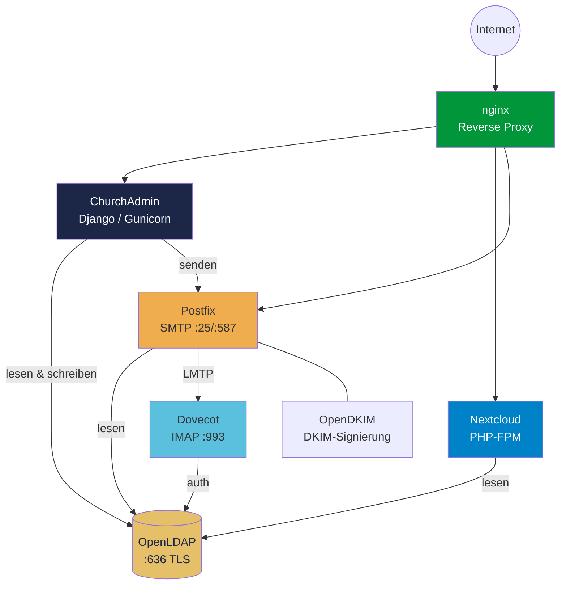

# Systemarchitektur - ChurchAdmin + LDAP + Postfix + Nextcloud

## Gesamtuebersicht



## Komponenten

### OpenLDAP (Zentrale Benutzerverwaltung)
- **Alle Benutzer** werden in LDAP verwaltet
- **Alle Gruppen** mit hierarchischer Struktur
- **Ein Account** fuer alle Dienste (SSO-artig)
- **Schemas**: inetOrgPerson, postModernalPerson, mailExtension, nextCloudUser, posixAccount

### ChurchAdmin (Verwaltungsoberflaeche)
- Verwaltet Benutzer, Familien, Gruppen in LDAP
- Berechtigungssystem, DSGVO, Massen-E-Mail
- **Schreibt** in LDAP (CRUD)
- URL: `wir.example-church.de`

### Nextcloud (Dateiverwaltung & Zusammenarbeit)
- **Liest** aus LDAP (Benutzer, Gruppen)
- Dateien teilen nach LDAP-Gruppen
- Profilbilder aus `jpegPhoto`
- URL: `cloud.example-church.de`

### Postfix + Dovecot (E-Mail)
- **Liest** aus LDAP (Mailboxen, Routing, Aliase, Domains)
- `mailRoutingAddress` → Weiterleitung an private Adresse
- `mailAliasAddress` → Alias-Adressen
- `mailGroup` → Gruppen-E-Mail-Adressen

## LDAP-Struktur

```
dc=example-church,dc=de
├── ou=Users
│   ├── cn=Max.Mustermann          (inetOrgPerson, postModernalPerson, mailExtension, nextCloudUser, posixAccount)
│   │   ├── cn=Kind.Mustermann       (Kind, nested unter Elternteil)
│   │   └── cn=Ehefrau.Bernau    (familyRole=spouse)
│   ├── cn=Pastor.Beispiel
│   └── ...
├── ou=Groups
│   ├── cn=Mitglieder            (groupOfNames, nextCloudGroup, groupMail)
│   │   ├── cn=Leitung
│   │   │   ├── cn=Älteste
│   │   │   ├── cn=Kassenwart
│   │   │   └── cn=JugendLeitung-1
│   │   └── cn=Mitarbeiter
│   │       ├── cn=Technik
│   │       ├── cn=Musik
│   │       │   ├── cn=Musikteam-1
│   │       │   └── cn=Musikteam-2
│   │       ├── cn=Dekoration
│   │       └── cn=Büchertisch
│   ├── cn=Besucher
│   ├── cn=Angehörige
│   ├── cn=Gäste
│   ├── cn=Kinder
│   │   ├── cn=Kinder-1 ... cn=Kinder-5
│   └── cn=Jugend
│       ├── cn=Jugend-1 ... cn=Jugend-3
├── ou=Domains
│   └── dc=example-church.de (mailDomain)
└── cn=nobody                    (Dummy fuer leere Gruppen)
```

## ObjectClasses pro Benutzer

| ObjectClass | Quelle | Attribute |
|-------------|--------|-----------|
| `inetOrgPerson` | Standard | cn, sn, givenName, mail, telephoneNumber, mobile, postalAddress, jpegPhoto |
| `postModernalPerson` | ldap-for-churches | birthDate, familyRole, accountDisabled, sex, civilState, Social Media |
| `mailExtension` | ldap-for-churches | mailRoutingAddress, mailAliasAddress, mailQuota, mailRoutingEnabled, mailAliasEnabled |
| `nextCloudUser` | ldap-for-churches | nextCloudEnabled, nextCloudQuota |
| `posixAccount` | rfc2307bis | uidNumber, gidNumber, homeDirectory, loginShell |

## ObjectClasses pro Gruppe

| ObjectClass | Zweck |
|-------------|-------|
| `groupOfNames` | Standard LDAP-Gruppe (member-Attribut) |
| `nextCloudGroup` | Sichtbar in Nextcloud |
| `groupMail` | Gruppen-E-Mail-Adresse (mailGroup) |

## Datenfluss

### Benutzer erstellen (ChurchAdmin)
1. Admin erstellt Benutzer in ChurchAdmin
2. ChurchAdmin schreibt in LDAP (alle ObjectClasses)
3. Postfix erkennt neue Mailbox (LDAP-Lookup)
4. Nextcloud erkennt neuen Benutzer (LDAP-Sync)
5. Willkommens-Mail wird versendet

### Passwort aendern
1. Benutzer aendert Passwort in ChurchAdmin
2. LDAP `userPassword` wird aktualisiert (SSHA)
3. Gilt sofort fuer alle Dienste (ChurchAdmin, Nextcloud, Dovecot/IMAP)

### Account deaktivieren
1. Admin setzt `accountDisabled=TRUE` in ChurchAdmin
2. ChurchAdmin blockiert Login (prueft VOR login())
3. Warn-E-Mail an Admins bei Login-Versuch
4. Nextcloud: Benutzer kann sich nicht mehr anmelden
5. Postfix: E-Mails werden weiterhin zugestellt (Postfach bleibt)

### Benutzer loeschen
1. Admin loescht Benutzer in ChurchAdmin
2. LDAP-Eintrag wird entfernt
3. Benachrichtigungs-E-Mail an geloeschten Benutzer
4. Nextcloud: Benutzer verschwindet (LDAP-Sync)
5. Postfix: Mailbox nicht mehr erreichbar

## Ports und Dienste

| Dienst | Port | Protokoll |
|--------|------|-----------|
| nginx | 80/443 | HTTP/HTTPS |
| ChurchAdmin (Gunicorn) | Unix Socket | WSGI |
| Nextcloud | via nginx | PHP-FPM |
| OpenLDAP | 636 | LDAPS |
| Postfix | 25/587 | SMTP/Submission |
| Dovecot | 993 | IMAPS |
| Dovecot LMTP | Unix Socket | LMTP |

## Zertifikate

Alle Dienste nutzen Let's Encrypt Zertifikate:
- `example-church.de` (Webseite)
- `mail.example-church.de` (Postfix, Dovecot)
- `wir.example-church.de` (ChurchAdmin)
- `cloud.example-church.de` (Nextcloud)
- `ldap.example-church.de` (OpenLDAP)

## Backup

| Was | Wie | Wo |
|-----|-----|-----|
| LDAP-Daten | `manage.py backup_ldap` | `/backups/` |
| LDAP-Schema | `slapcat -n0` | `/backups/schema_*/` |
| Django-DB | rsync (deploy excludiert) | Produktions-Server |
| Nextcloud-Daten | Bareos | Bareos Storage |
| Maildirs | Bareos | Bareos Storage |
