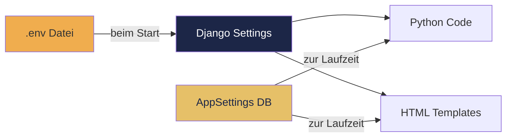

# Konfiguration - ChurchAdmin generisch einrichten

## Uebersicht

ChurchAdmin ist generisch aufgebaut. Alle gemeindespezifischen Werte werden ueber Umgebungsvariablen (`.env`) und die Datenbank (`AppSettings`) konfiguriert — kein Quellcode muss angepasst werden.



## Schritt 1: .env Datei erstellen

Kopieren Sie `.env.example` und passen Sie die Werte an:

```bash
cp .env.example .env
```

### Alle Variablen

| Variable | Beschreibung | Beispiel |
|----------|-------------|----------|
| `DJANGO_SECRET_KEY` | Zufaelliger Schluessel (mind. 50 Zeichen) | `python3 -c "from django.core.management.utils import get_random_secret_key; print(get_random_secret_key())"` |
| `ALLOWED_HOSTS` | Komma-getrennte erlaubte Hostnamen | `127.0.0.1,localhost,wir.meine-gemeinde.de` |
| `CSRF_TRUSTED_ORIGINS` | HTTPS-URLs fuer CSRF-Schutz | `https://wir.meine-gemeinde.de` |
| `CORS_ALLOWED_ORIGINS` | HTTPS-URLs fuer CORS | `https://wir.meine-gemeinde.de` |
| `LDAP_SERVER_URI` | LDAP-Server Adresse | `ldaps://ldap.meine-gemeinde.de` |
| `LDAP_BASE_DN` | LDAP Base Distinguished Name | `dc=meine-gemeinde,dc=de` |
| `LDAP_BIND_DN` | LDAP Admin-DN | `cn=admin,dc=meine-gemeinde,dc=de` |
| `LDAP_BIND_PASSWORD` | LDAP Admin-Passwort | *(geheim)* |
| `CHURCH_DOMAIN` | E-Mail-Domain der Gemeinde | `meine-gemeinde.de` |
| `EMAIL_HOST` | SMTP-Server (meist localhost/Postfix) | `meine-gemeinde.de` |
| `EMAIL_PORT` | SMTP-Port | `25` |
| `DEFAULT_FROM_EMAIL` | Absender fuer System-Mails | `webmaster@meine-gemeinde.de` |
| `SERVER_EMAIL` | Absender fuer Fehler-Mails | `webmaster@meine-gemeinde.de` |

### Beispiel .env

```bash
DJANGO_SECRET_KEY=mein-sehr-langer-zufaelliger-schluessel-hier
ALLOWED_HOSTS=127.0.0.1,localhost,wir.meine-gemeinde.de
CSRF_TRUSTED_ORIGINS=https://wir.meine-gemeinde.de
CORS_ALLOWED_ORIGINS=https://wir.meine-gemeinde.de

LDAP_SERVER_URI=ldaps://ldap.meine-gemeinde.de
LDAP_BASE_DN=dc=meine-gemeinde,dc=de
LDAP_BIND_DN=cn=admin,dc=meine-gemeinde,dc=de
LDAP_BIND_PASSWORD=mein-sicheres-passwort

CHURCH_DOMAIN=meine-gemeinde.de
EMAIL_HOST=meine-gemeinde.de
EMAIL_PORT=25
DEFAULT_FROM_EMAIL=webmaster@meine-gemeinde.de
SERVER_EMAIL=webmaster@meine-gemeinde.de
```

## Schritt 2: AppSettings in der Datenbank

Nach dem ersten Start unter **Django Admin → Anwendungseinstellungen** oder automatisch beim Deploy:

| Setting | Beschreibung | Beispiel |
|---------|-------------|----------|
| `church_name` | Name der Gemeinde (erscheint ueberall) | `Evangelische Freikirche Musterstadt` |
| `church_domain` | Domain | `meine-gemeinde.de` |
| `church_address` | Anschrift | `Kirchweg 1, 12345 Musterstadt` |
| `church_email` | Kontakt-E-Mail | `info@meine-gemeinde.de` |
| `church_phone` | Telefon (optional) | `+49 123 456789` |
| `church_contact_person` | Verantwortlicher (Impressum, DSGVO) | `Max Mustermann` |
| `privacy_contact_person` | Datenschutzbeauftragter | `Max Mustermann` |
| `church_register` | Vereinsregister | `VR 1234, Amtsgericht Musterstadt` |
| `church_tax_id` | Steuernummer | `123/456/789, Finanzamt Musterstadt` |

### Wo werden die Werte verwendet?

- **`church_name`** → Seitentitel, Footer, E-Mail-Vorlagen, Registrierungsseite, Opt-out-Links
- **`church_domain`** → Erkennung interner E-Mail-Adressen, homeDirectory-Pfad
- **`church_address`** → Datenschutzerklaerung (Verantwortlicher), Impressum
- **`church_contact_person`** → Impressum, Datenschutzerklaerung
- **`church_email`** → Impressum, Kontakthinweise

## Schritt 3: LDAP vorbereiten

### Schemas installieren

```bash
sudo ldapmodify -Y EXTERNAL -H ldapi:/// -f ldap/rfc2307bis.ldif
sudo ldapmodify -Y EXTERNAL -H ldapi:/// -f ldap/postfix.ldif
sudo ldapmodify -Y EXTERNAL -H ldapi:/// -f ldap/postModernalPerson.ldif
sudo ldapmodify -Y EXTERNAL -H ldapi:/// -f ldap/nextcloud.ldif
sudo ldapmodify -Y EXTERNAL -H ldapi:/// -f ldap/schema_extend_familyRole.ldif
sudo ldapmodify -Y EXTERNAL -H ldapi:/// -f ldap/schema_extend_familyRole_step2.ldif
sudo ldapmodify -Y EXTERNAL -H ldapi:/// -f ldap/schema_extend_accountDisabled.ldif
```

### LDAP-Basisstruktur

Die Grundstruktur wird beim ersten Start automatisch erwartet:

```
dc=meine-gemeinde,dc=de
├── ou=Users          ← Benutzer
├── ou=Groups         ← Gruppen
│   └── cn=Mitglieder ← Mindestens diese Gruppe
└── cn=nobody         ← Dummy fuer leere Gruppen
```

## Schritt 4: Deploy

```bash
# Erste Installation
python3 -m venv .venv
source .venv/bin/activate
pip install -r requirements.txt
python main/manage.py migrate
python main/manage.py seed_templates
python main/manage.py createsuperuser

# Produktion
sudo bash deploy.sh
```

### deploy.sh anpassen

Die `SRC_DIR` Variable in `deploy.sh` muss auf das lokale Quellverzeichnis zeigen:

```bash
SRC_DIR="/home/meinuser/ChruchAdmin"
```

## Schritt 5: systemd Service

Der Service laedt die `.env` automatisch:

```ini
[Service]
EnvironmentFile=/usr/share/python/ChruchAdmin/.env
```

Die Service-Datei wird beim Deploy automatisch installiert aus `config/systemd/churchadmin.service`.

## Wo ist was konfiguriert?

| Was | Wo | Wann gelesen |
|-----|-----|-------------|
| LDAP-Verbindung | `.env` | Beim Start (settings.py) |
| LDAP Base-DN | `.env` → `LDAP_BASE_DN` | Beim Start |
| E-Mail-Domain | `.env` → `CHURCH_DOMAIN` | Beim Start |
| Gemeindename | DB → `AppSettings` | Zur Laufzeit (jeder Request) |
| Impressum | DB → `LegalPage` | Zur Laufzeit |
| Datenschutzerklaerung | DB → `PrivacyPolicy` | Zur Laufzeit |
| Mail-Vorlagen | DB → `MailTemplate` | Zur Laufzeit |
| Berechtigungen | DB → `PermissionMapping` | Zur Laufzeit |

## Fuer eine andere Gemeinde einrichten

1. `.env` mit eigenen Werten erstellen
2. LDAP-Schemas installieren
3. `python main/manage.py migrate`
4. `python main/manage.py seed_templates`
5. `python main/manage.py createsuperuser`
6. Im Django-Admin: AppSettings, Impressum, Datenschutzerklaerung anpassen
7. `sudo bash deploy.sh`

Kein Quellcode muss geaendert werden.
