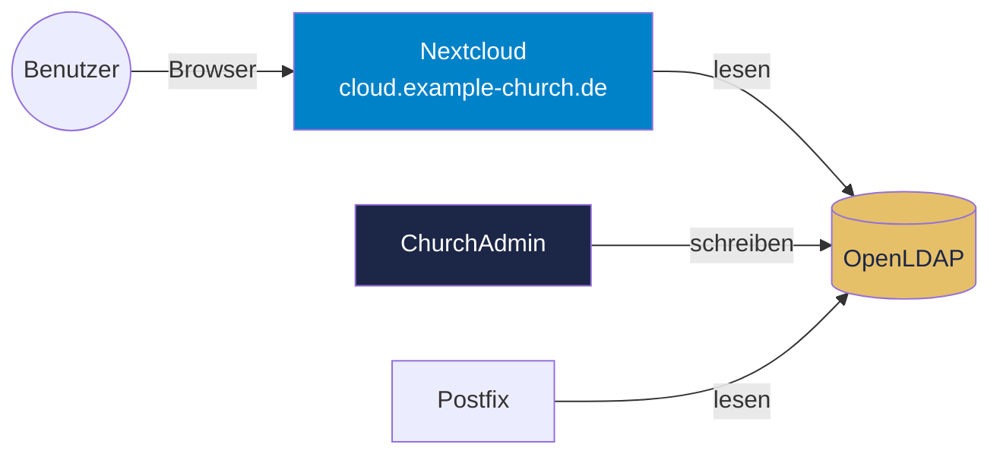

# Nextcloud + LDAP Konfiguration

## Uebersicht

Nextcloud nutzt den gleichen OpenLDAP-Server wie ChurchAdmin und Postfix. Benutzer melden sich mit ihrem Gemeinde-Account an und sehen nur die Gruppen, fuer die `nextCloudEnabled=TRUE` gesetzt ist.



## LDAP-Schema

Das `nextcloud.ldif` Schema definiert:

| ObjectClass | Beschreibung |
|-------------|-------------|
| `nextCloudUser` | Benutzer mit Nextcloud-Zugang |
| `nextCloudGroup` | Gruppe sichtbar in Nextcloud |

| Attribut | Beschreibung |
|----------|-------------|
| `nextCloudEnabled` | Zugang/Sichtbarkeit aktiv (TRUE/FALSE) |
| `nextCloudQuota` | Speicherplatz-Limit |

### Schema installieren

```bash
sudo ldapmodify -Y EXTERNAL -H ldapi:/// -f /etc/ldap/schema/nextcloud.ldif
```

## Nextcloud LDAP-Konfiguration

In Nextcloud unter **Einstellungen → LDAP/AD-Integration**:

### Server
| Einstellung | Wert |
|-------------|------|
| Host | `ldaps://ldap.example-church.de` |
| Port | 636 |
| Bind-DN | `cn=admin,dc=example-church,dc=de` |
| Bind-Passwort | *(aus .env)* |
| Base-DN | `dc=example-church,dc=de` |

### Benutzer
| Einstellung | Wert |
|-------------|------|
| Benutzer-Filter | `(&(objectClass=inetOrgPerson)(nextCloudEnabled=TRUE))` |
| Login-Attribute | `cn;mail` |
| Benutzer-Suche Base | `ou=Users,dc=example-church,dc=de` |
| Anzeigename | `displayName` |
| E-Mail | `mail` |

### Gruppen
| Einstellung | Wert |
|-------------|------|
| Gruppen-Filter | `(&(objectClass=nextCloudGroup)(nextCloudEnabled=TRUE))` |
| Gruppen-Suche Base | `ou=Groups,dc=example-church,dc=de` |
| Mitglieder-Attribut | `member` |

### Erweitert
| Einstellung | Wert |
|-------------|------|
| Quota-Attribut | `nextCloudQuota` |
| Home-Verzeichnis | *(Standard)* |
| Verschachteltes Suchen | Ja (fuer hierarchische Gruppen) |
| Profilbild | `jpegPhoto` |

## Zusammenspiel mit ChurchAdmin

### Benutzer aktivieren/deaktivieren

In ChurchAdmin wird `nextCloudEnabled` ueber die objectClass `nextCloudUser` gesteuert:

- **Neuer Benutzer erstellt** → `nextCloudEnabled=TRUE` setzen fuer Nextcloud-Zugang
- **Account deaktiviert** (`accountDisabled=TRUE`) → Benutzer kann sich nicht mehr anmelden (ChurchAdmin blockiert, Nextcloud prueft separat)
- **Benutzer geloescht** → Auch aus Nextcloud entfernt (LDAP-basiert)

### Gruppen-Sichtbarkeit

Gruppen mit `nextCloudGroup` objectClass und `nextCloudEnabled=TRUE` erscheinen in Nextcloud:

```
cn=Mitglieder,ou=Groups,...        → Sichtbar in Nextcloud
cn=Leitung,cn=Mitglieder,...       → Sichtbar (Untergruppe)
cn=Technik,cn=Mitarbeiter,...      → Sichtbar
cn=Musikteam-1,cn=Musik,...        → Sichtbar
```

### Quota verwalten

In ChurchAdmin kann `nextCloudQuota` pro Benutzer gesetzt werden:

```
nextCloudQuota: 5 GB     → 5 GB Speicher
nextCloudQuota: none     → Unbegrenzt
nextCloudQuota: default  → Server-Standard
```

## Dateien teilen

Nextcloud-Gruppen basieren auf LDAP-Gruppen:
- Musikteam-Mitglieder teilen Noten untereinander
- Leitung hat gemeinsamen Ordner
- Jugendleiter teilen Material mit ihrem Team

Die Gruppenzugehoerigkeit wird zentral in ChurchAdmin / LDAP verwaltet.

## Fehlerbehebung

```bash
# LDAP-Verbindung von Nextcloud testen
sudo -u www-data php /var/www/nextcloud/occ ldap:test-config s01

# LDAP-Cache leeren
sudo -u www-data php /var/www/nextcloud/occ ldap:reset-group
sudo -u www-data php /var/www/nextcloud/occ ldap:reset-user

# Benutzer-Mapping pruefen
sudo -u www-data php /var/www/nextcloud/occ ldap:check-user Vorname.Nachname

# Nextcloud-Logs
tail -f /var/www/nextcloud/data/nextcloud.log | grep -i ldap
```
